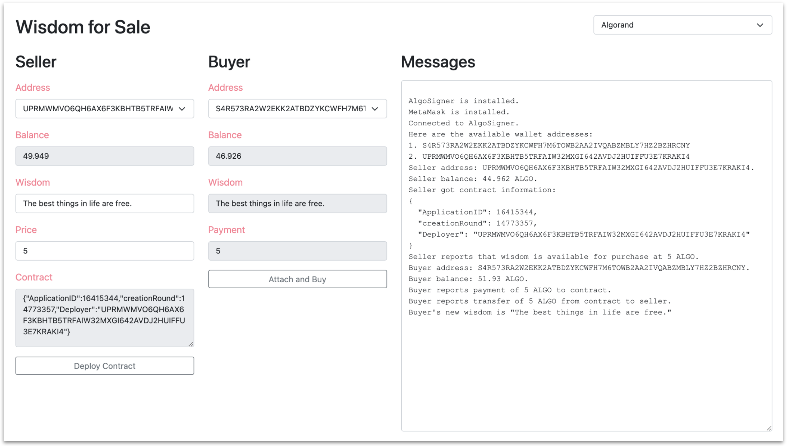

# Cmd and Web

Modeled after the Reach [Overview](https://github.com/reach-sh/reach-lang/tree/master/examples/overview) DApp, the example presented here supports two participants, a seller and a buyer. The seller sells a wise sentence for a price. The buyer buys it. The DApp includes two frontends: a JavaScript command-line frontend and a vanilla webpage frontend. Both use the same backend (`index.rsh` which compiles to `build/index.main.mjs`).

## Prerequisites

1. The Reach script (`reach`) is installed on your computer. You know how to run the script (e.g. `~/reach/reach`).
1. For the webpage version, your Node.js version is at least `v16.3.0`, and the AlgoSigner extension with at least two TestNet accounts is present in your browser.

## Limitations

1. The command-line version runs on Algorand or Ethereum.
1. The webpage version runs on Algorand TestNet only.

## Installation

```
% git clone https://github.com/hagenhaus/reach-examples.git
% cd reach-examples/cmd-and-web
```

## Command-line Version

The command-line version looks like this after an Algorand transaction:

```
% REACH_CONNECTOR_MODE=ALGO reach run
Seller reports that wisdom is available for purchase at 5 ALGO.
Buyer reports payment of 5 ALGO to contract.
Buyer reports transfer of 5 ALGO from contract to Seller.
Buyer reports new wisdom: "The best things in life are free."
```

To build and run the command-line example, execute one of the following commands:

```
% REACH_CONNECTOR_MODE=ALGO reach run
% REACH_CONNECTOR_MODE=ETH reach run
```

## Webpage Version

The webpage version looks like this after an Algorand transaction:



To build and run the webpage example, follow these steps:

1. Change directory to `./web`.

1. Run `node --version` and verify that your Node version is at least `v16.3.0`.

1. Verify that the AlgoSigner extension is present in your browser.

1. Verify that the AlgoSigner extension includes at least two TestNet accounts.

1. Run `npm install`.

1. Run `npx webpack --config webpack.config.cjs`.

1. Run `npx http-server`.

1. Browse to [localhost:8080](http://localhost:8080).

1. Copy your AlgoSigner password into your paste buffer. You will need it several times.

1. In *Choose network*, select *Algorand*, and sign in.

1. Click *Deploy Contract*. Continue to interact with AlgoSigner until you see the following sentence in Messages:

    *Seller reports that wisdom is available for purchase at 5 ALGO.*

1. Change to a Buyer address that is different from that of the Seller. This is optional.

1. Click *Attach and Buy.* Interact with AlgoSigner a few more times until you see the following sentence in Messages:

    *Buyer's new wisdom is "The best things in life are free."*

### How to modify and rerun

After every change you make to the `scripts.js` file, do the following:

1. `Ctrl-C` to stop the http-server.
1. Run `npx webpack --config webpack.config.cjs` to build a new *reach-webpack.js* file.
1. Run `npx http-server` to start the server.
1. In Chrome, press `Cmd + Shift + Delete`, check *Cached images and files*, and click *Clear data*.

## Notes

Here are the steps I follow to create the webpage environment:

1. Create a subdirectory with `mkdir web` and `cd web`.

1. Initialize the Node.js project with `npm init -y`, and add `"type": "module"` to package.json.

1. Install a server with `npm i http-server`.

1. Install webpack with `npm i webpack@4.46.0`. You may see these warnings:

    ```
    npm WARN deprecated urix@0.1.0: Please see https://github.com/lydell/urix#deprecated
    npm WARN deprecated resolve-url@0.2.1: https://github.com/lydell/resolve-url#deprecated
    npm WARN deprecated fsevents@1.2.13: fsevents 1 will break on node v14+ and could be using insecure binaries. Upgrade to fsevents 2.
    npm WARN deprecated chokidar@2.1.8: Chokidar 2 will break on node v14+. Upgrade to chokidar 3 with 15x less dependencies.
    ```

1. Install the webpack command-line interface with `npm i -D webpack-cli@4.7.2`.

1. Install the environment package with `npm i dotenv`. I don't use this yet. 

1. Create a `.env` file with `touch .env`.

1. Install the Reach standard library with `npm i @reach-sh/stdlib`.

1. Install the net package with `npm i net`.

1. Create the JavaScript file for use by your webpage with `touch scripts.js`. The frontend code goes here.

1. Create a webpage configuration file with `touch webpack.config.cjs`. Use this content:

    ```
    const path = require('path');
    const webpack = require('webpack')
    const dotenv = require('dotenv')

    module.exports = {
      entry: './scripts.js',
      mode: 'development',
      output: {
        filename: 'reach-webpack.js',
        path: path.resolve(__dirname, './'),
      },
      plugins: [
        new webpack.DefinePlugin({
          'process.env': JSON.stringify(dotenv.config().parsed)
        })
      ]
    };
    ```

1. Run `npx webpack --config webpack.config.cjs` to `create the reach-webpack.cjs` file.

1. Create a CSS file with `touch styles.css`. Styles go here.

1. Create an html file with `touch index.html`. Html goes here.

1. Run a server which loads the html page with `npx http-server`.

1. Browse to the html page with [localhost:8080](http://localhost:8080).
