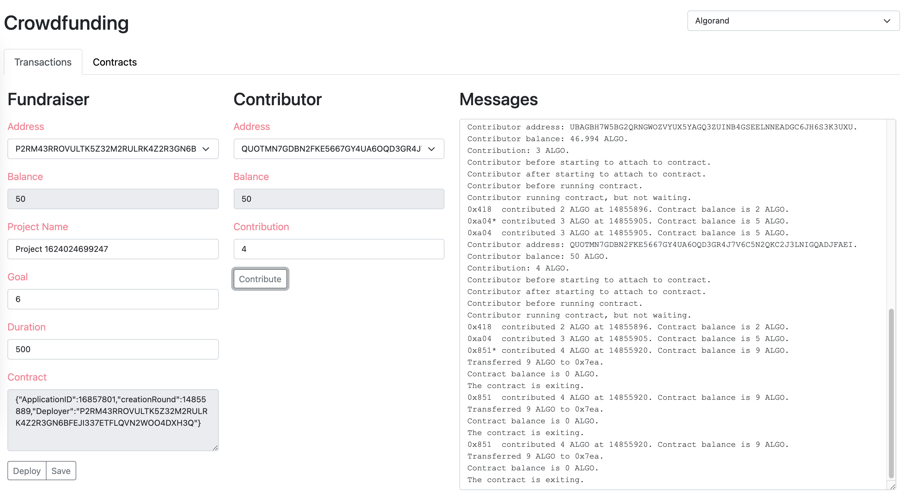

# Crowdfunding

This Reach example dapp includes both a web-based frontend and a command-line frontend for a backend (`build/index.main.mjs` compiled from `index.rsh`) which enables a Fundraiser to deploy a contract (with a fundraising goal and a contract duration) and multiple Contributers to contribute to the fund. The web frontend uses html, css, modular js, and bootstrap v5.x (no jquery).

## Prerequisites

You need to have the reach script installed. See [Install and Initialize](https://docs.reach.sh/tut-1.html) for details.

# Limitations

1. The command-line version runs on Algorand or Ethereum.
1. The webpage version runs on Algorand TestNet only unless you modify it yourself.
1. Does not refund yet if the contract times out.
1. Does not allow multiple contributions from the same contributor yet. 

## Installation

```
% git clone https://github.com/hagenhaus/reach-examples.git
% cd reach-examples/crowdfunding
```

## Build

```
% make build
```

## Run the command-line version

You can test this DApp using multiple terminals. First, run `make run-contributor` in a few terminals, specify the contribution for each contributor, and leave the app waiting for contract information. Next, run `make run-fundraiser` to completion in another terminal. Then, copy & paste the contraction information into the contributor terminals, click enter in each, and let them run to completion. The `*` next to an abbreviated address (e.g. `0x433*`) means the address belongs to the Contributor running in that particular terminal.

### Ethereum example run

#### Fundraiser

```
% make run-fundraiser
Your role is Fundraiser.
Your network type is devnet.
Your account balance is 1000 ETH.
Your project goal is 20 ETH.
Your contract deployment time is 52642
Your contract info is {"address":"0x123","creation_block":52642,"transactionHash":"0xabc"}
You are done.
```

#### Contributor 1

```
% make run-contributor
Your role is Contributor.
Your network type is devnet.
Your account balance is 1000 ETH.
What is your contribution in ETH? 1
What is the contract information? {"address":"0x123","creation_block":52642,"transactionHash":"0xabc"}
0x433* contributed 1 ETH at 52643. Contract balance is 1 ETH.
```

#### Contributor 2

```
% make run-contributor
Your role is Contributor.
Your network type is devnet.
Your account balance is 1000 ETH.
What is your contribution in ETH? 3
What is the contract information? {"address":"0x123","creation_block":52642,"transactionHash":"0xabc"}
0x433  contributed 1 ETH at 52643. Contract balance is 1 ETH.
0xe00* contributed 3 ETH at 52645. Contract balance is 4 ETH.
```

#### Contributor 3

```
% make run-contributor
Your role is Contributor.
Your network type is devnet.
Your account balance is 1000 ETH.
What is your contribution in ETH? 5
What is the contract information? {"address":"0x123","creation_block":52642,"transactionHash":"0xabc"}
0x433  contributed 1 ETH at 52643. Contract balance is 1 ETH.
0xe00  contributed 3 ETH at 52645. Contract balance is 4 ETH.
0xc7e* contributed 5 ETH at 52875. Contract balance is 9 ETH.
```

#### Contributor 4

```
% make run-contributor
Your role is Contributor.
Your network type is devnet.
Your account balance is 1000 ETH.
What is your contribution in ETH? 7
What is the contract information? {"address":"0x123","creation_block":52642,"transactionHash":"0xabc"}
0x433  contributed 1 ETH at 52643. Contract balance is 1 ETH.
0xe00  contributed 3 ETH at 52645. Contract balance is 4 ETH.
0xc7e  contributed 5 ETH at 52875. Contract balance is 9 ETH.
0x934* contributed 7 ETH at 53285. Contract balance is 16 ETH.
```

#### Contributor 5

```
% make run-contributor
Your role is Contributor.
Your network type is devnet.
Your account balance is 1000 ETH.
What is your contribution in ETH? 9
What is the contract information? {"address":"0x123","creation_block":52642,"transactionHash":"0xabc"}
0x433  contributed 1 ETH at 52643. Contract balance is 1 ETH.
0xe00  contributed 3 ETH at 52645. Contract balance is 4 ETH.
0xc7e  contributed 5 ETH at 52875. Contract balance is 9 ETH.
0x934  contributed 7 ETH at 53285. Contract balance is 16 ETH.
0x4Bd* contributed 9 ETH at 53794. Contract balance is 25 ETH.
Transferred 25 ETH to 0xbBf. Contract balance is 0 ETH.
The contract is exiting.
```

### Algorand example run

#### Fundraiser

```
% make run-fundraiser
Your role is Fundraiser.
Your network type is devnet.
Your account balance is 1000 ALGO.
Your project goal is 20 ALGO.
Your contract deployment time is 15
Your contract info is {"ApplicationID":46,"creationRound":8393,"Deployer":"ABC"}
You are done.
```

#### Contributor 1

```
% make run-contributor
Your role is Contributor.
Your network type is devnet.
Your account balance is 1000 ALGO.
What is your contribution in ALGO? 5
What is the contract information? {"ApplicationID":46,"creationRound":8393,"Deployer":"ABC"}
0x08e* contributed 5 ALGO at 18. Contract balance is 5 ALGO.
```

#### Contributor 2

```
% make run-contributor
Your role is Contributor.
Your network type is devnet.
Your account balance is 1000 ALGO.
What is your contribution in ALGO? 5
What is the contract information? {"ApplicationID":46,"creationRound":8393,"Deployer":"ABC"}
0x08e  contributed 5 ALGO at 18. Contract balance is 5 ALGO.
0x832* contributed 3 ALGO at 21. Contract balance is 8 ALGO.
```

#### Contributor 3

```
% make run-contributor
Your role is Contributor.
Your network type is devnet.
Your account balance is 1000 ALGO.
What is your contribution in ALGO? 5
What is the contract information? {"ApplicationID":46,"creationRound":8393,"Deployer":"ABC"}
0x08e  contributed 5 ALGO at 18. Contract balance is 5 ALGO.
0x832  contributed 3 ALGO at 21. Contract balance is 8 ALGO.
0x031* contributed 4 ALGO at 24. Contract balance is 12 ALGO.
```

#### Contributor 4

```
% make run-contributor
Your role is Contributor.
Your network type is devnet.
Your account balance is 1000 ALGO.
What is your contribution in ALGO? 5
What is the contract information? {"ApplicationID":46,"creationRound":8393,"Deployer":"ABC"}
0x08e  contributed 5 ALGO at 18. Contract balance is 5 ALGO.
0x832  contributed 3 ALGO at 21. Contract balance is 8 ALGO.
0x031  contributed 4 ALGO at 24. Contract balance is 12 ALGO.
0xb57* contributed 20 ALGO at 27. Contract balance is 32 ALGO.
Transferred 32 ALGO to 0x158.
Contract balance is 0 ALGO.
The contract is exiting.
```

## Run the web-based version

The webpage version looks like this after an Algorand transaction:



Follow these steps to run the web-based version:

1. Verify that the AlgoSigner extension is present in your Chrome browser.
1. Verify that the AlgoSigner extension includes at least two TestNet accounts.
1. Run `npm i http-server`.
1. Run `npx http-server`.
1. Browse to [http://127.0.0.1:8080](http://127.0.0.1:8080).
1. Copy your AlgoSigner password into your paste buffer. You will need it several times.
1. In *Choose network*, select *Algorand*, and sign in.
1. Click *Deploy*. Continue to interact with AlgoSigner until you see the following sentence in Messages:
    *You are done.*
1. Change to a Contributer address that is different from that of the Fundraiser.
1. Click *Contribute.* Interact with AlgoSigner a few more times until you see a sentence similar to the following (with an asterisk appended to the short address) in Messages:
    *0x418* contributed 2 ALGO at 14855896. Contract balance is 2 ALGO.*
