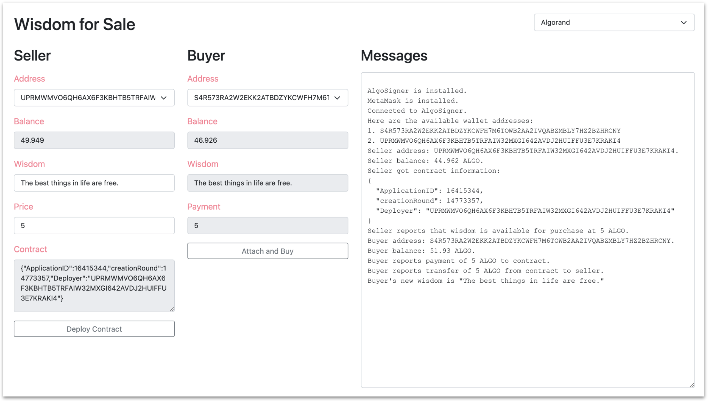

# Wisdom for Sale

This Reach example dapp includes both a web-based frontend and a command-line frontend for a simple backend (`build/index.main.mjs` compiled from `index.rsh`) which, modeled on the Reach [Overview](https://github.com/reach-sh/reach-lang/tree/master/examples/overview) dapp, enables a Seller to sell a wise phrase to a Buyer for a price.

## Prerequisites

You need to have the reach script installed. See [Install and Initialize](https://docs.reach.sh/tut-1.html) for details.

## Limitations

1. The command-line version runs on Algorand or Ethereum.
1. The webpage version runs on Algorand TestNet only unless you modify it yourself.

## Installation

```
% git clone https://github.com/hagenhaus/reach-examples.git
% cd reach-examples/wisdom-for-sale
```

## Run the command-line version

```
% reach run
% REACH_CONNECTOR_MODE=ALGO reach run
% REACH_CONNECTOR_MODE=ETH reach run
```

## Run the web-based version

The webpage version looks like this after an Algorand transaction:



Follow these steps to run the web-based version:

1. Verify that the AlgoSigner extension is present in your Chrome browser.
1. Verify that the AlgoSigner extension includes at least two TestNet accounts.
1. Run `npm i http-server`.
1. Run `npx http-server`.
1. Browse to [http://127.0.0.1:8080](http://127.0.0.1:8080).
1. Copy your AlgoSigner password into your paste buffer. You will need it several times.
1. In *Choose network*, select *Algorand*, and sign in.
1. Click *Deploy Contract*. Continue to interact with AlgoSigner until you see the following sentence in Messages:
    *Seller reports that wisdom is available for purchase at 5 ALGO.*
1. Change to a Buyer address that is different from that of the Seller. This is optional.
1. Click *Attach and Buy.* Interact with AlgoSigner a few more times until you see the following sentence in Messages:
    *Buyer's new wisdom is "The best things in life are free."*